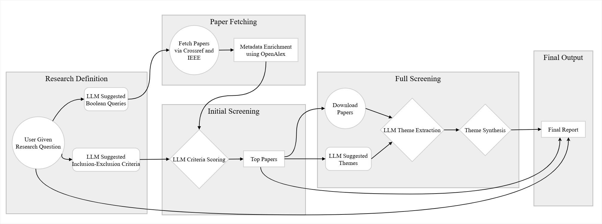

# AI-Backed Systematic Literature Review (SLR) Automation

This project automates a systematic literature review workflow using API-based paper retrieval, metadata enrichment, LLM screening, PDF collection, and category-level synthesis.

The current entry point is `app.py`, which runs an interactive, resumable pipeline. The older `main.py` / `config.py` flow is still present in the repository, but the app-driven pipeline is the one documented here.

## Pipeline



## Setup

Create and activate an environment, then install dependencies:

```bash
python -m venv .venv
.venv\Scripts\activate
pip install -r requirements.txt
```

If you use the provided VM helper, see `vm_setup.sh`.

## Environment Variables

Create a `.env` file in the project root with the credentials required by the GPT-backed steps. This repository currently reads configuration from environment variables used by the codebase, for example:

```env
GPT_ENDPOINT="https://your-endpoint.openai.azure.com/"
GPT_DEPLOYMENT="your-model-deployment"
GPT_KEY="your-key"
GPT_VERSION="2024-12-01-preview"
GPT_MAX_WORKERS="4"
```

You may also need any provider-specific keys required by the fetch / enrichment steps depending on your setup.

## Usage

Start a new run:

```bash
python app.py run
```

Start a new run with a fixed run id:

```bash
python app.py run --run-id my-slr-run
```

Resume a previous run by id:

```bash
python app.py resume my-slr-run
```

Resume using an explicit path:

```bash
python app.py resume .\_runs\my-slr-run\_run.json
```

The app is interactive. It prompts for:

- Research questions
- Whether to accept or edit the generated boolean query
- Whether to accept or replace the suggested criteria
- Whether to accept or replace the suggested categories

## What Gets Saved

Each run is stored under:

```text
_runs/<run_id>/
```

Important files:

- `_runs/<run_id>/_run.json`: full checkpoint state for the run
- `_runs/<run_id>/pdfs/`: downloaded PDFs for top papers
- `_runs/<run_id>/report.md`: final generated report

The run state includes:

- Inputs such as research questions, boolean query, queries, and criteria
- Timing and count statistics per stage
- All fetched and enriched papers keyed by `paper_id`
- Initial screening results
- Top paper selection
- Downloaded PDF paths
- Generated categories
- Full screening output for top papers
- Category syntheses
- Logged errors

Because the pipeline checkpoints its state, you can stop and resume without restarting completed stages.

## Outputs

The generated `report.md` includes:

- Research questions
- Suggested and final boolean queries
- Suggested and final criteria
- Pipeline timings
- Counts for fetched, deduplicated, screened, selected, downloaded, and fully screened papers
- A PRISMA-style flow summary
- A table of top papers
- Category synthesis sections

## Data Flow Details

### Fetch and Enrich

- `src/fetch_arxiv.py` retrieves papers from arXiv.
- `src/fetch_crossref.py` retrieves papers from Crossref.
- `src/utils.py` deduplicates fetched records.
- `src/enrich_openalex.py` enriches the merged set with OpenAlex metadata.

### Initial Screening

Initial screening runs on all fetched papers using the criteria generated earlier in the workflow. Results are stored under each paper's `screening` field and used to rank papers for top selection.

### Top Selection

Top papers are chosen by descending `relevance_score`, capped at 50 papers. If no papers have screening scores, no top set is created.

### PDF Download

PDFs for top papers are downloaded into the run-specific `pdfs/` folder. Paths are attached to each selected paper entry when the file exists on disk.

### Categories, Full Screening, and Synthesis

- Categories are generated from the abstracts of the selected papers.
- Full screening runs only for selected papers that have a downloaded PDF.
- Category synthesis aggregates evidence from the full-screening output and writes a synthesis per category.

## Project Structure

```text
.
|-- app.py
|-- main.py
|-- config.py
|-- prompts/
|   |-- screen_initial.txt
|   |-- screen_full.txt
|   |-- synthesize_category.txt
|-- src/
|   |-- app_helpers.py
|   |-- fetch_arxiv.py
|   |-- fetch_crossref.py
|   |-- enrich_openalex.py
|   |-- pdf_downloader.py
|   |-- gpt_research_q.py
|   |-- gpt_criteria.py
|   |-- gpt_categories.py
|   |-- gpt_screener_initial.py
|   |-- gpt_screener_full.py
|   |-- gpt_synthesis.py
|   |-- report.py
|   `-- utils.py
|-- _runs/
`-- test/
```

## Notes

- `app.py` is the current documented pipeline.
- `main.py` remains in the repository, but it follows an older file-driven workflow.
- Full screening depends on downloaded PDFs. Papers without a PDF are skipped at that stage.
- Category synthesis only runs when categories exist and at least one paper produced usable full-screening evidence.
