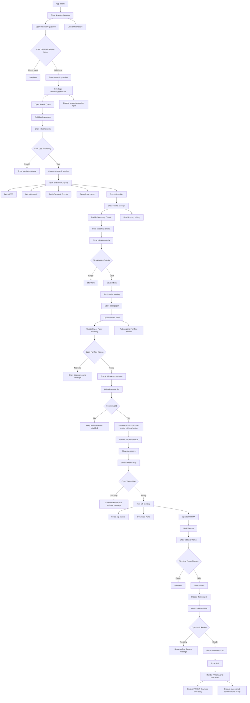

# ATLAS UI Flow

The app is grouped under four section headers:

1. `Research Question`
2. `Initial Paper Search`
3. `Paper Paper Reading`
4. `Systematic Literature Review`

The expander labels are:

1. `Research Question`
2. `Search Query`
3. `Screening Criteria`
4. `Full-Text Access`
5. `Theme Map`
6. `Draft Review`

Initially, all expanders are collapsed except the research-question step. The user is expected to move through the workflow in sequence. If they open a later step too early, the app shows an `st.info(...)` message explaining the prerequisite:

- `Start by entering your research question.`
- `Finish screening to continue.`
- `Enable full-text retrieval to continue.`
- `Confirm your themes to generate the draft.`

## 1. Research Question

The first header is `Research Question`. It contains one expander called `Research Question`. Inside it, the user sees:

- a text area labeled `Paste your main research question(s)`
- helper guidance explaining that specificity improves the generated query and screening rules
- a button labeled `Generate Review Setup`

At the beginning of the run, this is the only step that should be open. All later stages remain locked behind earlier steps.

If the user presses the button while the text area is empty, the app prevents the workflow from continuing. The user must provide at least one non-empty research question first.

If the user enters a valid research question and presses the button:

- the research question is stored in the run state
- the current stage becomes `research_questions`
- the app marks the workflow as started
- the next step, `Search Query`, becomes the active expander
- the research question input is no longer meant to be edited for the current run

This stage is handled by `start_autoslr()`.

## 2. Initial Paper Search

The second header is `Initial Paper Search`. It contains two expanders:

1. `Search Query`
2. `Screening Criteria`

### 2.1 Search Query

Once a valid research question has been confirmed, `Search Query` becomes the next active step.

When this expander opens, the app generates a suggested Boolean query from the research question by running:

- `build_boolean_query_from_questions(...)`

The generated query appears in an editable text area labeled `Suggested Boolean query. Edit it before searching.` When the user presses `Confirm Queries`:

- the query is validated with `parse_boolean_query(...)`
- the Boolean string is expanded into executable search strings with `boolean_to_queries(...)`
- paper retrieval and enrichment begin through `_fetch_and_enrich(...)`

Inside `_fetch_and_enrich(...)`, the app runs:

- `fetch_ieee(...)`
- `fetch_crossref(...)`
- `fetch_semanticscholar(...)`
- `deduplicate_papers_by_title_authors(...)`
- `enrich_openalex(...)`

The UI shows a spinner while sources are searched and results are combined. A log panel also appears with the latest fetch progress.

If the query is invalid, the app shows an error instructing the user to check parentheses, quotes, and Boolean operators before continuing.

After successful confirmation:

- the query text area becomes disabled
- the `Confirm Queries` button becomes disabled
- the app stores the confirmed query in the run state
- `Screening Criteria` becomes available

### 2.2 Screening Criteria

This expander is part of the same section, but it only becomes actionable after the query has been confirmed.

When the screening-criteria step is reached, the app generates suggested inclusion and exclusion rules using:

- `build_criteria_from_question(...)`
- `criteria_to_list(...)`

The rules are shown in an editable text area labeled `Suggested inclusion and exclusion rules. Refine them before screening papers.` The field is intentionally taller to support editing longer criteria lists.

If the user tries to confirm empty criteria, the app blocks progression. If valid criteria are confirmed:

- the selected criteria are saved into the run
- the criteria input becomes disabled
- the `Confirm Criteria` button becomes disabled
- the app starts abstract-level screening with `_run_initial_screening_live(...)`

While papers are being fetched, the criteria text area remains editable, but the `Confirm Criteria` button stays disabled until fetching is complete.

During `_run_initial_screening_live(...)`, papers are screened one by one with:

- `screen_paper(...)`

The results table updates live, including the `RS` score. After screening finishes, the `Full-Text Access` expander opens automatically, and the full-text section becomes the next usable stage.

## 3. Paper Paper Reading

The third header is `Paper Paper Reading`. It contains two expanders:

1. `Full-Text Access`
2. `Theme Map`

### 3.1 Full-Text Access

This step stays locked until initial screening has finished. If the user opens it too early, the app shows `Finish screening to continue.`

Once unlocked, the user sees:

- a helper package download labeled `Download Access Helper`
- a file uploader labeled `Upload session file (.json)`
- a button labeled `Enable Full-Text Retrieval`

The helper ZIP is built by `_build_proxy_helper_zip(...)`. After the user uploads a valid session file, the app stores the session and shows a success message indicating that full-text retrieval is ready. The `Full-Text Access` expander remains open after upload.

Disabled behavior in this step:

- `Enable Full-Text Retrieval` is disabled until a valid session file has been uploaded
- `Enable Full-Text Retrieval` is disabled again after it has already been confirmed

After confirmation:

- the stage is saved as `proxy_confirmed`
- the top screened papers table is shown
- `Theme Map` becomes active

### 3.2 Theme Map

This expander is locked until full-text retrieval has been enabled. If opened too early, it shows `Enable full-text retrieval to continue.`

When it becomes active, the app runs the full-text processing stage by calling:

- `_run_full_text_step(...)`

Inside `_run_full_text_step(...)`, the app runs:

- `select_top_ids(...)`
- `download_pdfs(...)`
- PRISMA count updates

After the full-text step completes, the app generates theme suggestions from the selected papers by running:

- `build_taxonomy_categories(...)`

The generated themes are shown in an editable text area labeled `Suggested themes from the top papers. Rename, merge, remove, or add themes.`

When the user confirms them:

- the theme text is parsed and stored
- the themes text area becomes disabled
- the `Use These Themes` button becomes disabled
- `Draft Review` becomes the next active step

This confirmation is handled by `confirm_themes()`.

## 4. Systematic Literature Review

The fourth header is `Systematic Literature Review`. It contains one expander: `Draft Review`.

This expander remains locked until the research themes have been confirmed. If the user opens it too early, the app shows `Confirm your themes to generate the draft.`

When unlocked, the app generates and displays the review draft area. In the current implementation, this includes:

- a generated report placeholder stored in `st.session_state.full_report`
- a draft view under the `Draft Review` expander
- a PRISMA section labeled `Study selection flow`
- download buttons labeled `Download PRISMA diagram`, `Download review draft`, and `Download review data`

The download area uses:

- `build_prisma_svg(...)`
- `_render_download_buttons(...)`

Disabled behavior in the final step:

- the PRISMA download stays disabled until PRISMA data exists
- the review draft download stays disabled until report text exists

## Locked and Disabled State Summary

- `Paste your main research question(s)` and `Generate Review Setup` are disabled after the workflow has started.
- `Suggested Boolean query. Edit it before searching.` and `Confirm Queries` are disabled after query confirmation.
- `Suggested inclusion and exclusion rules. Refine them before screening papers.` remains editable after query confirmation, but `Confirm Criteria` stays disabled until fetching completes and remains disabled after criteria are confirmed.
- `Enable Full-Text Retrieval` is disabled until a valid session upload exists.
- `Use These Themes` is disabled until there is non-empty theme text, and remains disabled after confirmation.
- `Draft Review` is not disabled as a control, but it is logically locked by the previous steps and only shows an info message until prerequisites are complete.

## Mermaid Flowchart

