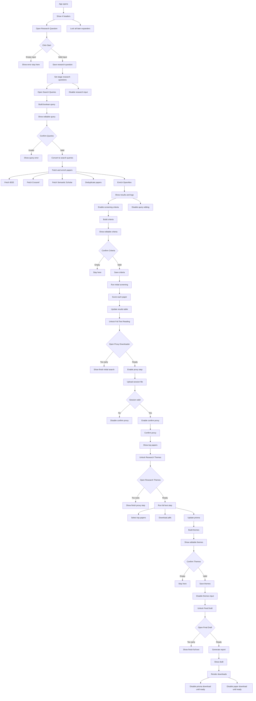

# ATLAS UI Flow

The app is organized into four main sections, each with its own header:

1. `What is your research?`
2. `Initial Search`
3. `Full Text Reading`
4. `Systematic Literature Review`

Initially, all expanders are collapsed except `Research Question`. The user is expected to move through the workflow in sequence. If they open a later expander too early, the app shows an `st.info(...)` message explaining what must be completed first, for example:

- `Enter research questions first.`
- `Finish initial search first.`
- `Finish proxy downloader first.`
- `Finish full text reading first.`

## 1. What is your research?

The first header is `What is your research?`. It contains one expander called `Research Question`. Inside it, the user sees:

- a text area for entering one or more research questions
- a button to confirm and start the workflow

At the beginning of the run, this is the only expander that should be open. All later stages remain locked behind earlier steps.

If the user presses the button while the text area is empty, the app shows an error and prevents the workflow from continuing. The user must provide at least one non-empty research question first.

If the user enters a valid research question and presses the button:

- the research question is stored in the run state
- the current stage becomes `research_questions`
- the app marks the first step as started/completed
- the `Search Queries` expander in the next section opens
- the research question input is no longer meant to be edited for the current run

In the implementation, this stage is handled by `start_autoslr()`.

## 2. Initial Search

The second header is `Initial Search`. It contains two expanders:

1. `Search Queries`
2. `Initial screening criteria`

### 2.1 Search Queries

Once a valid research question has been confirmed, the `Search Queries` expander becomes the next active step.

When this expander opens, the app generates a suggested Boolean query from the research question by running:

- `build_boolean_query_from_questions(...)`

The generated query appears in an editable text area so the user can refine it before confirming. When the user presses `Confirm Queries`:

- the query is validated with `parse_boolean_query(...)`
- the Boolean string is expanded into executable search strings with `boolean_to_queries(...)`
- paper retrieval and enrichment begin through `_fetch_and_enrich(...)`

Inside `_fetch_and_enrich(...)`, the app runs:

- `fetch_ieee(...)`
- `fetch_crossref(...)`
- `fetch_semanticscholar(...)`
- `deduplicate_papers_by_title_authors(...)`
- `enrich_openalex(...)`

The UI shows a spinner while papers are being fetched and enriched. A log panel also appears with the latest fetch progress.

If the query is invalid, the app shows an error and the user cannot continue until the query is fixed.

After successful confirmation:

- the query text area becomes disabled
- the `Confirm Queries` button becomes disabled
- the app stores the confirmed query in the run state
- the criteria step becomes available

### 2.2 Initial screening criteria

This expander is part of the same `Initial Search` section, but it should only become actionable after the queries have been confirmed.

When the criteria step is reached, the app generates suggested inclusion/exclusion criteria using:

- `build_criteria_from_question(...)`
- `criteria_to_list(...)`

The criteria are shown in an editable text area so the user can remove, rewrite, or add criteria.

If the user tries to confirm empty criteria, the app blocks progression. If valid criteria are confirmed:

- the selected criteria are saved into the run
- the criteria input becomes disabled
- the `Confirm Criteria` button becomes disabled
- the app starts abstract-level screening with `_run_initial_screening_live(...)`

During `_run_initial_screening_live(...)`, papers are screened one by one with:

- `screen_paper(...)`

The results table updates live, including the `RS` relevance score. After screening finishes, the `Full Text Reading` section becomes the next usable stage.

## 3. Full Text Reading

The third header is `Full Text Reading`. It contains two expanders:

1. `Download (Proxy Downloader)`
2. `Research Themes`

### 3.1 Download (Proxy Downloader)

This step stays locked until initial screening has finished. If the user opens it too early, the app shows `Finish initial search first.`

Once unlocked, the user sees:

- a helper package download
- a file uploader for the session JSON
- a `Confirm Proxy` button

The helper ZIP is built by `_build_proxy_helper_zip(...)`. After the user uploads a valid session file, the app stores the authentication session and enables the proxy confirmation button.

Disabled behavior in this step:

- `Confirm Proxy` is disabled until a valid session JSON has been uploaded
- `Confirm Proxy` is disabled again after it has already been confirmed

After proxy confirmation:

- the stage is saved as `proxy_confirmed`
- the top screened papers table is shown
- the `Research Themes` expander becomes active

### 3.2 Research Themes

This expander is locked until proxy confirmation is complete. If opened too early, it shows `Finish proxy downloader first.`

When it becomes active, the app runs the full-text processing stage by calling:

- `_run_full_text_step(...)`

Inside `_run_full_text_step(...)`, the app runs:

- `select_top_ids(...)`
- `download_pdfs(...)`
- PRISMA count updates

After the full-text step completes, the app generates theme suggestions from the selected papers by running:

- `build_taxonomy_categories(...)`

The generated themes are shown in an editable text area. When the user confirms them:

- the theme text is parsed and stored
- the themes text area becomes disabled
- the `Confirm Themes` button becomes disabled
- the `Final Draft` expander becomes the next active step

This confirmation is handled by `confirm_themes()`.

## 4. Systematic Literature Review

The fourth header is `Systematic Literature Review`. It contains one expander: `Final Draft`.

This expander remains locked until the research themes have been confirmed. If the user opens it too early, the app shows `Finish full text reading first.`

When unlocked, the app generates and displays the final SLR draft area. In the current implementation, this includes:

- a generated report placeholder stored in `st.session_state.full_report`
- a generated-paper view under the `Final Draft` expander
- download buttons for PRISMA, the Markdown paper, and the run logs

The download area uses:

- `build_prisma_svg(...)`
- `_render_download_buttons(...)`

Disabled behavior in the final step:

- the PRISMA image download stays disabled until PRISMA data exists
- the full paper download stays disabled until report text exists

## Locked and Disabled State Summary

- `Research Question` text area and start button are disabled after the workflow has started.
- `Search Queries` text area and confirm button are disabled after queries are confirmed.
- `Initial screening criteria` controls are disabled until queries are confirmed, and remain disabled after criteria are confirmed.
- `Confirm Proxy` is disabled until a valid session upload exists.
- `Research Themes` confirm button is disabled until there is non-empty theme text, and remains disabled after confirmation.
- `Final Draft` is not disabled as a control, but it is logically locked by the previous steps and only shows an info message until prerequisites are complete.

## Mermaid Flowchart

