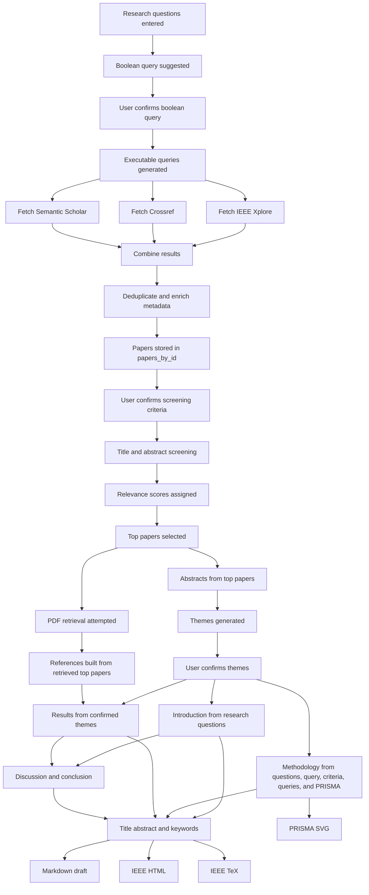

# ATLAS Final Draft Generation Pipeline

This report explains how ATLAS creates the final systematic literature review draft, which inputs feed each section, and where those inputs are produced in the current implementation.

## 1. Main Orchestrator

The final draft is assembled by `src/atlas/results/generate_full_draft.py`.

That function reads the current `run` object and generates sections in this order:

1. Introduction
2. Methodology
3. References
4. Results and Findings
5. Discussion
6. Conclusion
7. Title, Abstract, and Keywords
8. Markdown draft, IEEE HTML, IEEE TeX, and PRISMA SVG outputs

The draft generator expects these run-level inputs to exist before it can proceed:

- `run["inputs"]["research_questions"]`
- `run["inputs"]["boolean_query_used"]`
- `run["inputs"]["criteria_used"]`
- `run["inputs"]["queries"]`
- `run["prisma"]`
- `run["categories"]`
- `run["top_paper_ids"]`
- `run["papers_by_id"]`

If research questions, confirmed query, confirmed criteria, confirmed themes, or usable references are missing, draft generation stops with an error.

## 2. Where the Inputs Come From

### 2.1 Research Questions

The researcher enters one or more research questions in the Streamlit UI. After the workflow starts, the app stores them in:

- `run["inputs"]["research_questions"]`

This happens in `streamlit.py` inside `start_autoslr()`.

### 2.2 Boolean Query and Executable Queries

ATLAS generates a suggested Boolean query from the research questions. After the user confirms or edits it, the app stores:

- `run["inputs"]["boolean_query_used"]`
- `run["inputs"]["queries"]`

The first field is the final Boolean query string. The second field is the list of expanded executable search strings derived from that Boolean query.

This happens in `streamlit.py` inside `confirm_queries()`.

### 2.3 Screening Criteria

ATLAS proposes inclusion and exclusion criteria from the research question. After the user confirms or edits them, the app stores:

- `run["inputs"]["criteria_used"]`

This happens in `streamlit.py` inside `confirm_criteria()`.

### 2.4 Retrieved Papers

After query confirmation, ATLAS searches IEEE Xplore, Crossref, and Semantic Scholar, deduplicates the results, enriches metadata with OpenAlex, and stores the merged paper set in:

- `run["papers_by_id"]`

This happens through `fetch_and_enrich()` in `src/atlas/utils/streamlit_pipeline.py`.

### 2.5 Initial Screening and Top Papers

ATLAS screens titles and abstracts against the confirmed criteria. Each paper receives a screening result that includes a relevancy score.

Later, `select_top_ids()` chooses top papers with:

- minimum `relevance_score >= 3`
- descending score order
- title as a secondary sort key

Those selected papers are stored in:

- `run["top_paper_ids"]`

If a PDF is found, the corresponding top-paper entry also gets:

- `pdf_path`

This happens in `run_full_text_step()` in `src/atlas/utils/streamlit_pipeline.py`.

### 2.6 Research Themes

After the top papers are selected, ATLAS collects the abstracts of those selected papers and uses them to generate theme suggestions. Once the user confirms or edits them, the final theme map is stored in:

- `run["categories"]`

This is important: in the current Streamlit path, the confirmed themes are based on the abstracts of the top selected papers, not directly on the final synthesized full-text evidence.

Theme generation is triggered in `streamlit.py` with `build_taxonomy_categories(...)`, and final confirmation happens in `confirm_themes()`.

## 3. Section-by-Section Inputs

### 3.1 Introduction

The Introduction section is generated from:

- `run["inputs"]["research_questions"]`

`src/atlas/results/gpt_introduction.py` sends a prompt like:

- `Research questions: ...`
- `Introduction paragraph:`

So the introduction is driven only by the research questions, not by the retrieved papers, themes, or references.

### 3.2 Methodology

The Methodology section is generated from:

- `run["inputs"]["research_questions"]`
- `run["inputs"]["boolean_query_used"]`
- `run["inputs"]["queries"]`
- `run["inputs"]["criteria_used"]`
- `run["prisma"]`
- fixed ATLAS methodology context from `src/atlas/results/prompts/atlast_methodology_context.txt`

`src/atlas/results/gpt_methodology.py` builds a structured user prompt containing:

- the research questions
- the exact Boolean query used
- the expanded executable queries
- the inclusion and exclusion criteria
- the PRISMA counts
- ATLAS workflow context that explains how the system should be described in an academically defensible way

The methodology prompt explicitly tells the model to explain the PRISMA flow using the exact counts supplied.

### 3.3 References

The References section is built from:

- `run["top_paper_ids"]`
- `run["papers_by_id"]`

Only selected top papers with a non-empty `pdf_path` are converted into IEEE-style references. In other words, a paper must be selected and successfully retrieved to be listed in the final references.

Reference formatting happens in `src/atlas/results/gpt_results.py`.

### 3.4 Results and Findings

The Results and Findings section is generated from:

- `run["categories"]`
- the generated IEEE references text

`src/atlas/results/gpt_results.py` converts the themes into a draft theme block and asks GPT to rewrite that content into a coherent narrative with IEEE bracket citations.

This means the current Results section is not created directly from raw full-text extraction outputs. It is created from the confirmed theme map plus the reference list.

### 3.5 Discussion and Conclusion

Discussion and Conclusion are generated after Results. Their inputs are:

- generated `introduction`
- generated `results`

`src/atlas/results/gpt_discussion_conclusion.py` asks for exactly two paragraphs:

- paragraph 1: discussion, gaps, challenges, future work
- paragraph 2: conclusion

### 3.6 Title, Abstract, and Keywords

The title block is generated last from:

- generated `introduction`
- generated `methodology`
- generated `results`
- generated `discussion`
- generated `conclusion`

`src/atlas/results/gpt_abstract.py` asks GPT to return:

- `TITLE: ...`
- `ABSTRACT: ...`
- `KEYWORDS: ...`

So the abstract is a summary of the already-generated body sections, not an independently generated first step.

## 4. Current End-to-End Data Flow

The actual draft pipeline in the current UI can be summarized as:

1. User enters research question.
2. ATLAS proposes a Boolean query.
3. User confirms or edits the Boolean query.
4. ATLAS expands the Boolean query into executable search strings.
5. ATLAS fetches papers from IEEE Xplore, Crossref, and Semantic Scholar.
6. ATLAS deduplicates and enriches results.
7. User confirms or edits screening criteria.
8. ATLAS screens titles and abstracts and computes relevance scores.
9. ATLAS selects top papers with `relevance_score >= 3`.
10. ATLAS attempts PDF retrieval for the selected top papers.
11. ATLAS generates research themes from the abstracts of the selected top papers.
12. User confirms or edits the themes.
13. ATLAS optionally performs full-text screening on retrieved PDFs before draft generation.
14. ATLAS generates Introduction, Methodology, References, Results, Discussion, Conclusion, and then Title/Abstract/Keywords.
15. ATLAS renders the final outputs as Markdown, IEEE HTML, IEEE TeX, and PRISMA SVG.

## 5. Mermaid 8.8.0 Diagram

The following diagram uses basic `flowchart TD` syntax that is compatible with Mermaid 8.8.0.

## 6. Important Implementation Note

There is a meaningful distinction between what the pipeline can compute and what the final draft currently consumes.

ATLAS does have a full-text screening stage and also contains a helper for category synthesis from extracted full-text evidence:

- `run_full_screening(...)`
- `run_category_synthesis(...)`
- `synthesize_category(...)`

However, the current Streamlit draft path does not feed those synthesized full-text category summaries into `generate_full_draft()`. Instead, the Results section uses:

- confirmed `run["categories"]`
- generated references

As a result, the current final draft is best described as:

- introduction driven by research questions
- methodology driven by protocol inputs and PRISMA counts
- results driven by confirmed theme labels and descriptions
- citations driven by the subset of selected papers with retrieved PDFs

It is not yet a fully evidence-grounded results synthesis directly generated from the extracted quotes and category paragraphs of the full-text analysis stage.

## 7. Key Files

- `streamlit.py`
- `src/atlas/results/generate_full_draft.py`
- `src/atlas/results/gpt_introduction.py`
- `src/atlas/results/gpt_methodology.py`
- `src/atlas/results/gpt_results.py`
- `src/atlas/results/gpt_discussion_conclusion.py`
- `src/atlas/results/gpt_abstract.py`
- `src/atlas/utils/streamlit_pipeline.py`
- `src/atlas/utils/app_helpers.py`
