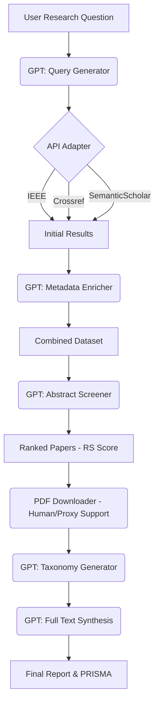

# ATLAS Technical Repository Guide

This document provides a technical deep-dive into the ATLAS codebase, explaining the file structure, core logic, and system architecture.

## 1. Project Structure Overhead
```text
SLR-Auto/
├── src/atlas/               # Core application logic
│   ├── inital_fetch/        # Query generation and API clients
│   ├── inital_screen/       # LLM-based abstract screening
│   ├── read_paper/          # PDF downloading and taxonomy extraction
│   ├── results/             # Report generation and PRISMA
│   └── utils/               # Shared helpers (logging, streamlit utilities)
├── data/                    # Local storage for session logs and results
├── assets/                  # UI assets (logo, documentation images)
├── markdown/                # Documentation and report files
├── streamlit.py             # Main application entry point
└── pyproject.toml           # Project dependencies
```

---

## 2. Core Modules (src/atlas)

### 2.1 Initial Fetch (`inital_fetch/`)
-   **`gpt_research_q.py`**: Translates simple research questions into multi-keyword Boolean queries.
-   **`fetch_ieee.py` / `fetch_crossref.py` / `fetch_semanticscholar.py`**: Standardized adapters that wrap database-specific APIs.
-   **`enrich_openalex.py`**: Fetches missing metadata (like full abstracts or specific DOIs) from the OpenAlex open-access database.

### 2.2 Initial Screen (`inital_screen/`)
-   **`gpt_criteria.py`**: Suggests inclusion/exclusion rules based on the user's research question.
-   **`gpt_screener_initial.py`**: The "workhorse" that screens hundreds of titles/abstracts. It calculates a **Relevancy Score (RS)** for each paper.

### 2.3 Read Paper (`read_paper/`)
-   **`pdf_downloader.py`**: Handles complex PDF retrieval using proxies and direct downloads.
-   **`gpt_categories.py`**: Reads the top 50 abstracts to auto-generate a taxonomy of themes.
-   **`gpt_screener_full.py`**: Provides the deep analysis of full-text PDFs against the approved themes.

### 2.4 Results & Synthesis (`results/`)
-   **`prisma.py`**: Programmatically generates an SVG flow diagram following PRISMA 2020 standards.
-   **`generate_full_draft.py`**: Orchestrates the assembly of the final SLR markdown document.
-   **`generate_session_report.py`**: Creates the "Audit Trail" Excel file.

---

## 3. System Flow (Mermaid)



---

## 4. How to Run Locally

### Prerequisites
-   Python 3.10+
-   An OpenAI API Key (configured in `.env`)
-   Optional: IEEE Xplore API Key

### Installation
1.  **Clone the Repo:**
    ```bash
    git clone https://github.com/joey-en/SLR-Auto.git
    cd SLR-Auto
    ```
2.  **Setup Virtual Environment:**
    ```powershell
    python -m venv venv
    .\venv\Scripts\Activate.ps1
    ```
3.  **Install Dependencies:**
    ```bash
    pip install -e .
    ```

### Running the App
```bash
streamlit run streamlit.py
```

---

## 5. Key Design Decisions

### Why GPT-4o?
GPT-4o was selected over Gemini or Fanar due to its native handling of PDF byte-streams and its large context window, which is critical for "reading" multiple full-text research papers simultaneously without losing context.

### Deterministic Screening
Hallucinations are the biggest risk in AI-assisted research. ATLAS mitigates this by:
1.  Setting `temperature=0` for screening and full-text extraction tasks.
2.  Setting `temperature=0.5` for query suggestion, screening-criteria suggestion, and taxonomy/theme suggestion to allow limited creativity while remaining more stable than higher-temperature defaults.
3.  Keeping those suggestion stages human-in-the-loop so proposed queries, criteria, and themes require researcher approval before downstream use.
4.  Prompting the model to provide **supporting quotes** for full-text inclusion and extraction decisions.
